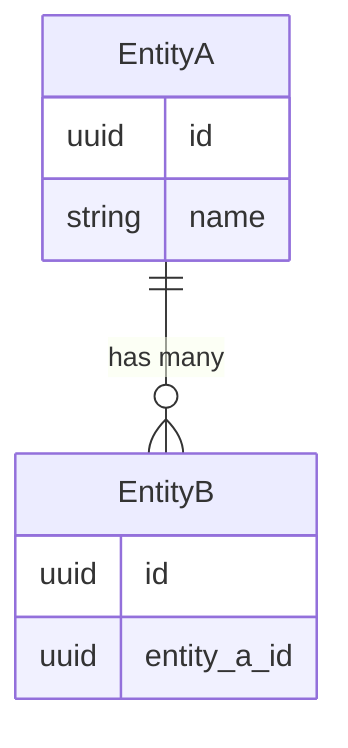

# ARCH-data-model

> arc42 §5 — Building Block View, data perspective.

## Entities

### `<EntityName>`

| Field | Type | Constraints | Notes |
|---|---|---|---|
| id | uuid | PK, not null | |
| <field> | <type> | <constraints> | <notes> |
| created_at | timestamptz | not null, default now() | |

**Relations:**
- belongs_to: `<OtherEntity>` (FK `<other_entity>_id`)
- has_many: `<ChildEntity>`

**Invariants:**
- <Domain rule that the entity must satisfy.>

---

### `<NextEntity>`

...

## ER Diagram

## Migrations

- Migration tool: <alembic | knex | prisma | ...>
- Conventions: <one migration per PR, never edit applied migrations, ...>
