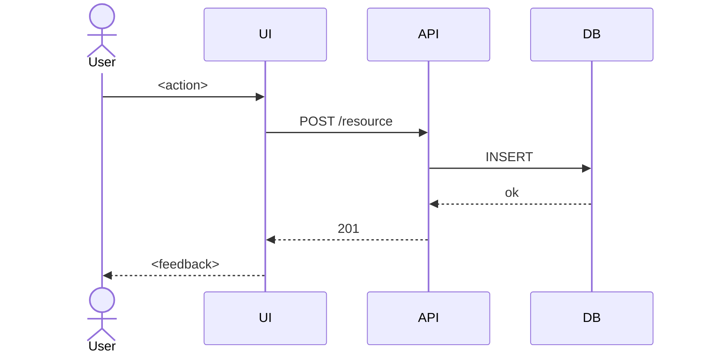

# ARCH-dataflow

> arc42 §6 — Runtime View. How the system behaves at runtime for the main scenarios.

## Scenario 1 — <Name of main use case>

**Trigger:** <What initiates this flow.>
**Actors:** <User, external system, scheduler, ...>

**Failure modes:**
- <Component fails> → <What happens, how recovered>

---

## Scenario 2 — <Name>

...
