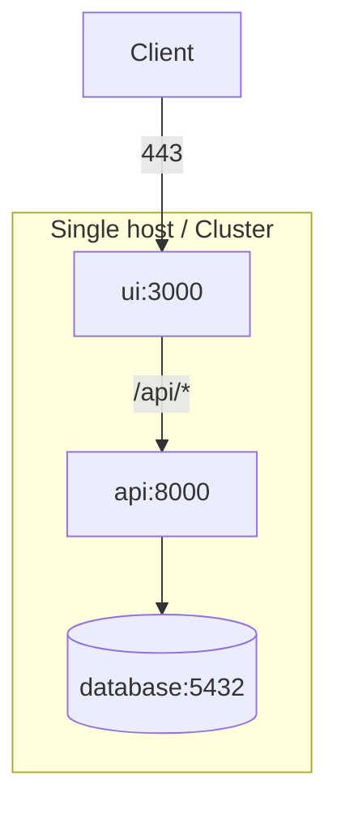

# ARCH-deployment

> arc42 §7 — Deployment View. Where the software runs.

## Topology

## Containers / Services

| Container | Image | Ports | Volumes | Exposed |
|---|---|---|---|---|
| <name> | <image:tag> | <internal:external> | <mount points> | yes / no |

## Networking

- <ingress / reverse proxy details>
- <internal network name>
- <which ports are public>

## Configuration

| Env Var | Default | Purpose |
|---|---|---|
| `<VAR>` | `<default>` | <what it controls> |

## Persistence

| Volume | Path in container | Backed up? |
|---|---|---|
| <name> | /data | yes / no |

## Operational

- **Logs:** <where they go>
- **Metrics:** <if any>
- **Health checks:** <endpoint, interval>
- **Restart policy:** <unless-stopped | always | ...>
