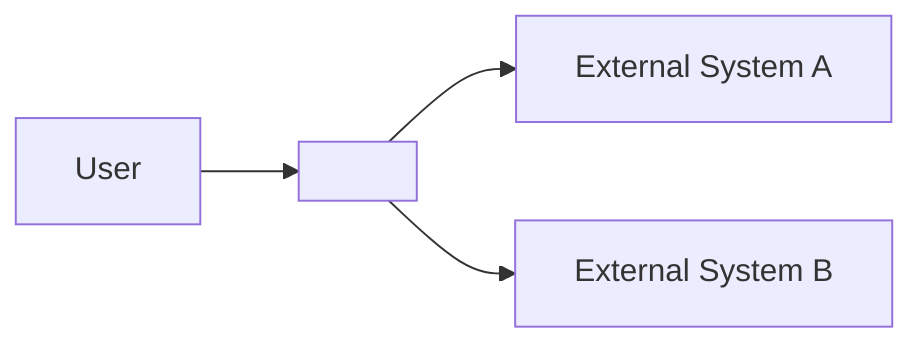

# ARCH-system-overview

> arc42 §3 — Context and Scope. The system's place in its environment.

## Purpose

<One paragraph: what the system does and for whom.>

## Business Context

| Communication partner | Direction | Purpose |
|---|---|---|
| <External actor or system> | in / out / bidirectional | <Why they interact with the system> |

## Technical Context

| External system | Protocol | Interface |
|---|---|---|
| <External system name> | HTTPS / gRPC / SQL / ... | <Endpoint or driver> |

## Context Diagram

## Boundaries

**In scope:**
- <Capability>
- <Capability>

**Out of scope:**
- <Excluded capability>

## Related Documents

- ARCH-data-model
- ARCH-dataflow
- ARCH-deployment
- ADR-001, ADR-002, ...
