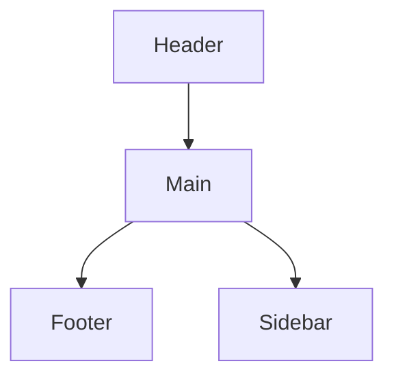

# UI-<slug>

> Screen / component specification. Include states, interactions, and accessibility notes.

## Purpose

<One paragraph: what this screen is for, who uses it, when.>

## Layout

(Or embed a static SVG / link to Figma if available.)

## Components

| Component | Role | Props / State | Source |
|---|---|---|---|
| `<Component>` | <purpose> | <props> | `src/components/<...>` |

## States

| State | Trigger | Visual change |
|---|---|---|
| empty | no data | <description> |
| loading | fetching | spinner / skeleton |
| error | request failed | inline error banner |
| populated | data present | list / detail |

## Interactions

1. <User action> → <System reaction>
2. ...

## Accessibility

- Keyboard navigation: <tab order, shortcuts>
- ARIA roles: <landmarks, live regions>
- Color contrast: WCAG AA minimum (4.5:1 body, 3:1 large)
- Focus management: <where focus goes after action X>

## Linked Requirements

- REQ-F###
- REQ-NF##
